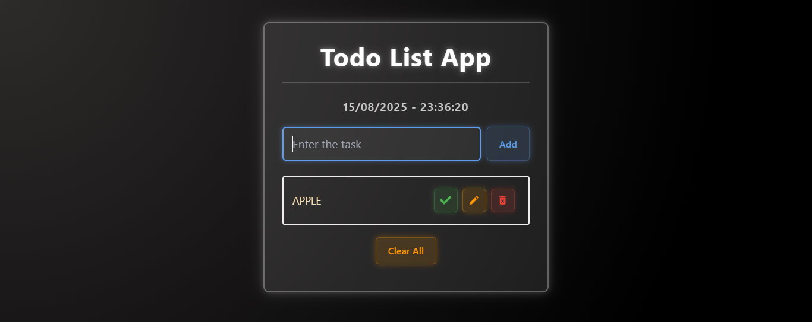

# Todo List App

A sleek and modern Todo List application built with React.js. This app allows users to add, complete, and delete tasks with a beautiful UI and persistent local storage. It also displays the current date and time dynamically.

---

## Screenshot

---

## Table of Contents

- [Demo](#demo)
- [Features](#features)
- [Technologies Used](#technologies-used)
- [How It Works](#how-it-works)
- [File Structure](#file-structure)
- [How to Run](#how-to-run)
- [Screenshot](#screenshot)
- [Author](#author)
- [License](#license)
- [Support](#support)

---

## Demo

[Live Demo on Netlify](https://todo-app-mumar.netlify.app)

---

## Features

- Add new tasks with validation to prevent duplicates
- Mark tasks as completed/uncompleted
- Delete individual tasks
- Clear all tasks at once
- Update the task as well
- Persistent data saved in browser localStorage
- Real-time date and time display
- Responsive and visually appealing UI with hover and focus effects

---

## Technologies Used

- React (Functional Components & Hooks)
- JavaScript (ES6+)
- CSS3 (Flexbox, Transitions, Gradients)
- React Icons for UI icons

---

## How It Works

- Tasks are saved and retrieved from `localStorage` to maintain state between sessions.
- The date and time update every second.
- User interactions like adding, updating, completing, deleting, and clearing tasks update the UI and localStorage accordingly.

---

## File Structure

|  FILE NAME     | Description                              |
|----------------|------------------------------------------|
| TodoList.jsx   | For all the html and javascript code     |
| TodoList.css   | CSS file for the style and neon effects |

- All these files have been uploaded in this repository.

---

## How to Run

Anyone can run this project easily by following these steps:

1. *Download or fork this repository*  
   - Click the green Code button above and select *Download ZIP* or click **Fork** to clone it.

2. *Open the folder*  
   - Inside the folder, find the `TodoList.jsx` file.

3. *Copy and paste the code*  
   - Open the `TodoList.jsx` file.  
   - Copy the code from it.  
   - Paste it into your *VS Code* or any code editor you're using.  
   - Save the file and open it in your browser.

✅ Now you can see the Todo List app in action!

---

## Author

*Muhammad Umar Hassan*  
- 📚 BSCS Student | Frontend Learner  
- 🔗 https://www.linkedin.com/in/m-umarh  
- 📧 mumarh135@gmail.com

---

## License

- This project is licensed under the *MIT License*.  
- You are free to use, modify, and share it.

---

## Support

If you like this project:

- ⭐ Star this repository  
- 🍴 Fork it  
- 🧑‍💻 Share it with others

Thank you for visiting!
